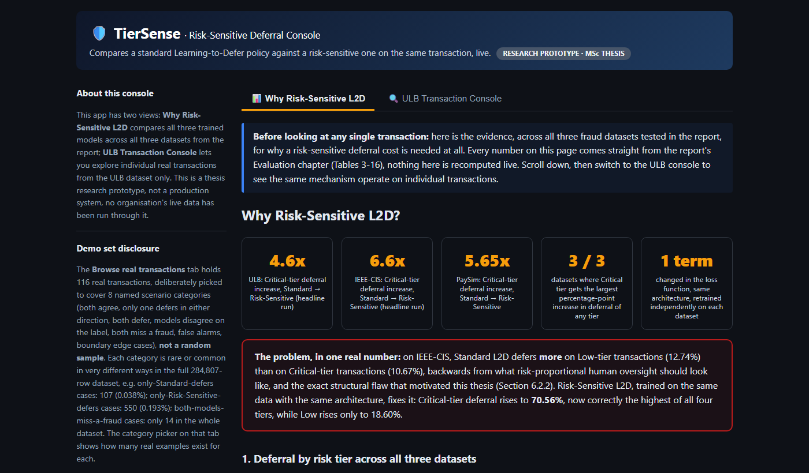

# A Risk-Sensitive Learning-to-Defer Framework for Responsible AI in Financial Fraud Detection

**[▶ Live demo](https://dhwanikariya.github.io/tiersense-l2d-fraud-console/)** ·
**[📄 Read the thesis (PDF)](thesis/Risk-Sensitive-L2D-Fraud-Detection_MSc-Thesis.pdf)** ·
**[🛠 Configuration manual](thesis/Risk-Sensitive-L2D-Fraud-Detection_Configuration-Manual.pdf)**

This is my MSc thesis project (MSc in Artificial Intelligence for Business, National College of
Ireland, 2026, supervised by Dr Muslim Jameel Syed). It has the report, the notebooks, the
trained models, every result, and a small demo console so the numbers in the report aren't just
numbers, you can actually poke at the thing.

[](https://dhwanikariya.github.io/tiersense-l2d-fraud-console/)

The demo is a static page, nothing to install. Both trained models run in your browser in plain
JS, so nothing gets sent anywhere.

## The idea in one paragraph

Learning-to-Defer (L2D) models learn when to make a decision themselves and when to hand it to a
human. Every published L2D formulation charges the same cost for deferring any case, so a
misclassified €5 transaction counts the same as a misclassified €500,000 one. That sits badly
with Article 14 of the EU AI Act, which says human oversight should be proportionate to risk.
This project swaps the fixed deferral cost for an instance-level one, weighted by a four-tier risk
matrix (Low, Medium, High, Critical) built from each dataset's transaction amounts. Same
architecture, one term changed in the loss.

## Headline results

Standard L2D vs Risk-Sensitive L2D, trained with the same architecture on each dataset:

| Dataset | Critical-tier deferral (Standard → Risk-Sensitive) | Increase | F1 (Standard → Risk-Sensitive) |
|---|---|---|---|
| ULB Credit Card Fraud | 0.21% → 0.96% | **4.6x** | 0.774 → 0.738 |
| IEEE-CIS | 10.67% → 70.56% | **6.6x** | 0.400 → 0.559 |
| PaySim | 0.68% → 3.84% | **5.65x** | 0.599 → 0.617 |

The most interesting finding was on IEEE-CIS: Standard L2D actually deferred *more* on Low-tier
transactions (12.74%) than on Critical-tier ones (10.67%), which is backwards. The risk-sensitive
version fixes the ordering. The effect holds across multiple seeds (ULB 4.6x to 24.7x over 5
seeds, IEEE-CIS 5.5x to 6.8x over 4), and the stress tests in `scripts/` check it against a
hand-written rule baseline and a weight-sensitivity sweep. Limitations (simulated expert,
seed-dependent effect size on ULB, PaySim checked at one seed) are discussed in Chapter 7 of the
thesis.

## What's in here

```
thesis/      the final report and the configuration manual (PDF)
docs/        the live demo, served by GitHub Pages (plain HTML/CSS/JS, no build step)
notebooks/   the 7 notebooks that build and evaluate all three models on all three datasets
scripts/     stress tests written later: weight sensitivity, rule baselines, multi-seed runs
models/      the two trained ULB checkpoints (standard and risk-sensitive)
results/     every JSON/CSV/PNG the notebooks and scripts produced, none of it hand edited
prototype/   the original Streamlit version of the console, kept for reference
```

A few notes:

- **models/**: IEEE-CIS and PaySim get retrained inside their notebooks and aren't saved
  separately.
- **docs/**: see [`docs/README.md`](docs/README.md). The JS forward pass was checked against the
  real PyTorch models on all 116 demo transactions, with the same decisions everywhere.
- **prototype/**: I moved off Streamlit because Streamlit Cloud kept needing manual redeploys and
  the free tier sleeps the app, which got annoying for something that's supposed to just be a
  link people click.

## Reproducing the results

The raw datasets aren't included. They're Kaggle datasets and redistributing them isn't allowed
under Kaggle's terms. Download them and put them in a `data/` folder at the repo root like this:

```
data/
├── creditcard.csv                           ULB, https://www.kaggle.com/datasets/mlg-ulb/creditcardfraud
├── PS_20174392719_1491204439457_log.csv     PaySim, https://www.kaggle.com/datasets/ealaxi/paysim1
└── ieee-cis/                                IEEE-CIS, https://www.kaggle.com/c/ieee-fraud-detection
    ├── train_transaction.csv
    └── train_identity.csv
```

Then:

```
pip install -r requirements-pipeline.txt
jupyter notebook
```

Run the notebooks in `notebooks/` in order (01, 02, 02.1, 03 to 06), then the scripts from the
repo root, e.g. `python scripts/07_ulb_weight_sensitivity.py`. Notebook 02 creates
`data/creditcard_with_tiers.csv`, which everything after it depends on. No GPU needed. The
heaviest run (IEEE-CIS) takes about 8 minutes on a normal laptop. Full details, including exact
package versions, are in the
[configuration manual](thesis/Risk-Sensitive-L2D-Fraud-Detection_Configuration-Manual.pdf).

## Running the demo locally

```
cd docs
python -m http.server 8000
```

then open localhost:8000. Or just double-click `docs/index.html`.

The old Streamlit version:

```
cd prototype
pip install -r requirements.txt
streamlit run app.py
```

## Citing

If this is useful to you, there's a [`CITATION.cff`](CITATION.cff), or:

```
Kariya, D. S. (2026). A Risk-Sensitive Learning-to-Defer Framework for Responsible AI in
Financial Fraud Detection. MSc thesis, National College of Ireland.
```

## License

The code is under the [MIT License](LICENSE). The thesis and configuration manual PDFs in
`thesis/` are © 2026 Dhwani Sanjay Kariya, all rights reserved. You're welcome to read, link and
cite them.
